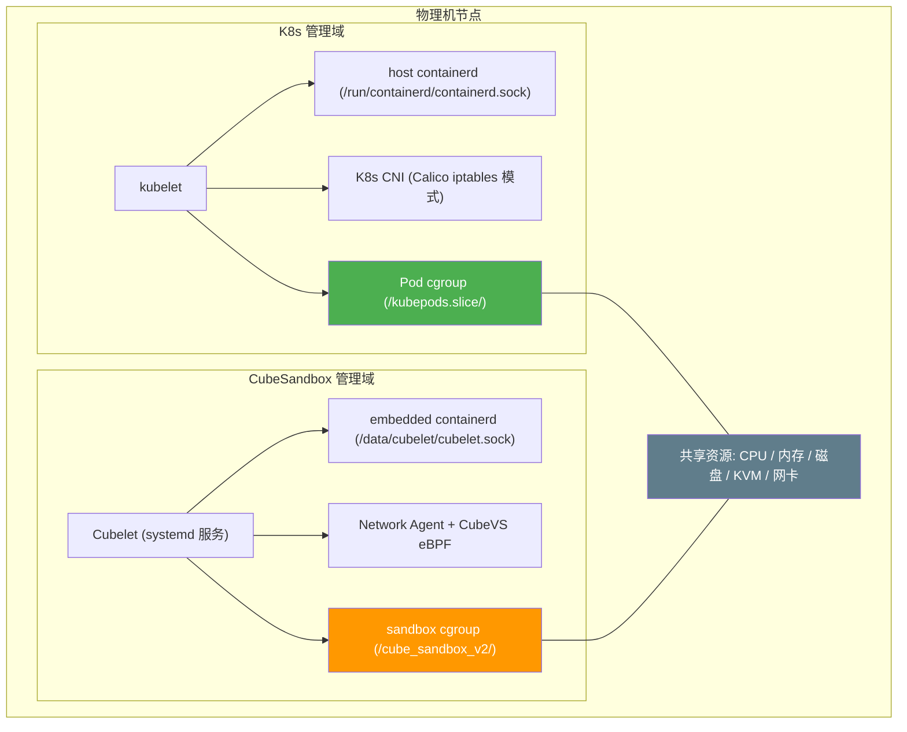
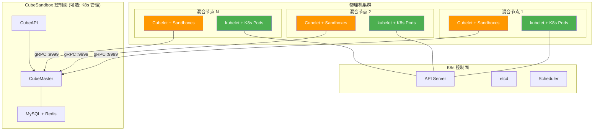

# CubeSandbox 与 K8s 物理机混合部署可行性分析

本文档基于代码级分析，评估在同一物理机集群上同时部署 K8s 和 CubeSandbox 的可行性。K8s 负责管理 Pod 工作负载，CubeSandbox 负责管理 Sandbox（MicroVM）工作负载，两者共享物理机资源。

---

## 结论

**可行，且冲突点远少于预期。**

CubeSandbox 在架构设计上与 K8s 高度解耦：它运行独立的 embedded containerd 实例、使用独立的 cgroup 子树、不修改 host containerd 配置。只要解决网络 CIDR 隔离和存储要求，两者可以在同一台物理机上和平共存。

---

## 架构模型



---

## 逐项分析

### 1. containerd：完全隔离，零冲突

**CubeSandbox 不使用宿主机的 containerd。** Cubelet 进程内部嵌入了一个完整的 containerd v2 server，与 K8s 使用的 host containerd 完全独立。

| 资源 | Host Containerd (K8s) | Cubelet Embedded Containerd |
|------|----------------------|----------------------------|
| Socket | `/run/containerd/containerd.sock` | `/data/cubelet/cubelet.sock` |
| Root dir | `/var/lib/containerd` | `/data/cubelet/root` |
| State dir | `/run/containerd` | `/data/cubelet/state` |
| Metadata DB | host containerd 的 BoltDB | Cubelet 自己的 BoltDB |
| Shim binary | `containerd-shim-runc-v2` | `containerd-shim-cube-rs` |
| Runtime type | `io.containerd.runc.v2` | `io.containerd.cube.rs` |

代码证据：
- `Cubelet/services/server/server.go:101`：`containerdserver.New(ctx, config.Config)` 嵌入完整 containerd server
- `Cubelet/config/config.toml:20`：`address = "/data/cubelet/cubelet.sock"` 使用独立 socket
- `deploy/one-click/install.sh`：**不修改** `/etc/containerd/config.toml`，不重启 host containerd

**结论：无需任何改造，两者天然隔离。**

### 2. cgroup：完全隔离，零冲突

Cubelet 使用独立的 cgroup 子树前缀，与 kubelet 管理的 cgroup 层级完全不重叠。

| 管理方 | cgroup 路径前缀 |
|--------|----------------|
| kubelet (K8s) | `/kubepods.slice/` (v2) 或 `/kubepods/` (v1) |
| Cubelet | `/cube_sandbox/sandbox/` (v1) 或 `/cube_sandbox_v2/sandbox/numaN/` (v2) |

代码证据：
- `Cubelet/plugins/cube/internals/cgroup/handle/interface.go:31`：`DefaultPathPoolV1 = "/cube_sandbox/sandbox"`
- `Cubelet/plugins/cube/internals/cgroup/handle/interface.go:33`：`DefaultPathPoolV2 = "/cube_sandbox_v2/sandbox"`
- `deploy/one-click/install.sh:229-235`：写入 `+cpu` 到 `cgroup.subtree_control` 是幂等操作，K8s 节点上 cpu 已启用则跳过

默认配置 `disable_host_cgroup: true`（`Cubelet/dynamicconf/conf.yaml:10`）意味着 Cubelet 创建 cgroup 目录但不强制设置资源限制，进一步降低冲突风险。

**结论：cgroup 层级完全隔离，无需改造。**

### 3. 网络：需配置 CIDR 隔离，其余兼容

这是需要最多关注的领域，但实际情况比预期好很多。

#### 3.1 eBPF TC filter 与 K8s CNI

CubeSandbox 的 CubeVS 在 `eth0` ingress 和 `lo` ingress 上附加 eBPF TC filter（`CubeNet/cubevs/miscs.go:118,124`），使用 priority 1、handle 1、`direct-action` 模式（`cubevs.go:106-108`）。

**与 Calico iptables 模式兼容**：Calico iptables 模式不附加任何 TC BPF filter，它使用 iptables/nftables 规则。因此 CubeSandbox 的 eBPF filter 与 Calico iptables 模式在 TC 层面无冲突。

**与 Cilium/Calico eBPF 模式不兼容**：如果 K8s CNI 也使用 eBPF（如 Cilium），两者会在 `eth0` 的同一 TC hook 点竞争，CubeSandbox 的 `Replace()` 调用会覆盖 CNI 的 filter。

**推荐**：K8s 使用 Calico iptables 模式或 Flannel。

#### 3.2 BPF Map 命名

CubeSandbox 的 BPF map 直接 pin 到 `/sys/fs/bpf/` 根目录（`cubevs.go:104`），map 名称如 `ifindex_to_mvmmeta`、`egress_sessions` 等是 CubeSandbox 特有的，不会与 Calico（`cali_` 前缀）或 Cilium（`cilium_` 前缀）的 map 名称冲突。

#### 3.3 CIDR 隔离（需要配置）

默认 sandbox CIDR 为 `192.168.0.0/18`（`Cubelet/config/config.toml:63`），可能与 K8s Pod CIDR 重叠。

**必须修改**：将 CubeSandbox CIDR 改为与 K8s 不重叠的地址段，例如：

```toml
# Cubelet/config/config.toml
cidr = "172.30.0.0/18"  # 与 K8s Pod CIDR 10.244.0.0/16 不重叠
```

同时修改 network-agent 配置中的对应字段。

#### 3.4 临时端口范围（需注意）

Network Agent 启动时将全局临时端口范围改为 `10000-19999`（`network-agent/local_service.go:118`）：

```go
os.WriteFile("/proc/sys/net/ipv4/ip_local_port_range", []byte("10000\t19999"), 0644)
```

这是宿主机全局设置，会影响所有进程包括 K8s 组件。K8s NodePort 默认范围 `30000-32767` 不受影响，但可能影响其他使用高位端口的应用。

**建议**：确认节点上无其他服务依赖默认临时端口范围（`32768-60999`）。

#### 3.5 DNS 配置（条件性风险）

- **有 systemd-resolved 的节点**（Ubuntu 20.04+, RHEL 9+）：CubeSandbox 使用 `resolvectl` 做 split DNS，只对 `~cube.app` 域做特殊处理，**不修改** `/etc/resolv.conf`。与 K8s DNS 完全兼容。
- **无 systemd-resolved 的节点**：会重写 `/etc/resolv.conf`，将 nameserver 指向 `169.254.254.53`。可能干扰 K8s 组件的 DNS 解析。

**建议**：确保节点使用 systemd-resolved。

#### 3.6 网络设备

CubeSandbox 会创建：
- `cube-dev` dummy 接口（`network-agent/netdevice.go:192`）
- 数百个 TAP 设备 `z{IP}`（`network-agent/netdevice.go:316`）
- 静态路由 `172.30.0.0/18` via `cube-dev`（修改 CIDR 后）

这些都在独立的网络命名空间中操作，不干扰 K8s 的 pod 网络。

### 4. 端口：无冲突

| CubeSandbox 端口 | 用途 | K8s 端口 | 用途 |
|------------------|------|---------|------|
| 9966 | Cubelet debug | 6443 | API server |
| 9998 | Cubelet HTTP | 10250 | kubelet |
| 9999 | Cubelet gRPC | 10257 | controller-manager |
| 8089 | CubeMaster | 10259 | scheduler |
| 20000-29999 | host proxy | 30000-32767 | NodePort |

**无重叠，无需修改。**

### 5. KVM 设备：节点前提条件

每个 sandbox 需要 `/dev/kvm`（`hypervisor/src/kvm/mod.rs:968`）。物理机天然满足，云 VM 需要嵌套虚拟化支持。

如果 K8s 集群中已有 Kata Containers 使用 KVM，两者会竞争 KVM 资源（CPU VT-x/AMD-V 上下文切换）。建议 CubeSandbox 节点不同时运行 Kata。

### 6. XFS 存储：节点前提条件

Cubecow 存储引擎依赖 XFS reflink（`cubecow/Cargo.toml:5`）。`/data/cubelet` 必须在 XFS 文件系统上（`install.sh:168-202`）。

**部署步骤**：
```bash
# 在 CubeSandbox 节点上准备 XFS 分区
mkfs.xfs -m reflink=1 /dev/sdX
mkdir -p /data/cubelet
mount /dev/sdX /data/cubelet
echo '/dev/sdX /data/cubelet xfs defaults 0 0' >> /etc/fstab
```

K8s 的 kubelet 数据目录（`/var/lib/kubelet`）可以继续使用 ext4 或其他文件系统，两者互不影响。

### 7. 安全模型：各自独立

CubeSandbox 以 root 运行并需要 `CAP_SYS_ADMIN`、`CAP_NET_ADMIN`、`CAP_NET_RAW`、`CAP_BPF`（所有 systemd unit 都是 `User=root`）。但这不影响 K8s：

- CubeSandbox 不是 K8s Pod，不受 K8s SecurityContext 约束
- CubeSandbox 以 systemd 服务运行，与 kubelet 是同级进程
- 两者各自管理自己的工作负载安全（K8s 用 SecurityContext/PSS，CubeSandbox 用 guest 内 seccomp）

**无需改造。**

---

## 推荐部署架构



### 节点准备清单

| 步骤 | 命令/配置 | 说明 |
|------|----------|------|
| 1. 确认 KVM | `ls -la /dev/kvm` | 物理机天然支持 |
| 2. 准备 XFS | `mkfs.xfs -m reflink=1 /dev/sdX` | CubeSandbox 存储 |
| 3. 挂载 | `mount /dev/sdX /data/cubelet` | fstab 持久化 |
| 4. 确认 cgroup v2 | `cat /sys/fs/cgroup/cgroup.controllers` | 需含 cpu |
| 5. 安装 K8s | 标准 kubeadm 安装流程 | CNI 选 Calico iptables 模式 |
| 6. 安装 CubeSandbox | `curl -sL .../online-install.sh \| bash` | 标准安装流程 |
| 7. 修改 CIDR | 编辑 `config.toml` 中 `cidr` 字段 | 避免与 K8s Pod CIDR 重叠 |

### 两套管理域的职责划分

| 维度 | K8s 管理 | CubeSandbox 管理 |
|------|---------|-----------------|
| 工作负载类型 | 普通容器 Pod | 安全沙箱 MicroVM |
| 编排 | Deployment/StatefulSet/DaemonSet | CubeMaster 调度 |
| 网络 | Calico CNI (pod 网络) | CubeVS eBPF (sandbox 网络) |
| 存储 | PVC / CSI | XFS reflink (/data/cubelet) |
| cgroup | /kubepods.slice/ | /cube_sandbox_v2/ |
| containerd | host containerd | embedded containerd |
| 监控 | Prometheus + metrics-server | CubeSandbox WebUI |

---

## 风险与缓解

| 风险 | 级别 | 缓解措施 |
|------|------|---------|
| CIDR 重叠导致路由混乱 | **高** | 部署前规划好 CIDR，确保 K8s Pod CIDR 与 CubeSandbox CIDR 不重叠 |
| `ip_local_port_range` 被修改 | **中** | 确认节点无服务依赖默认临时端口范围，或在 CubeSandbox 启动后重启受影响服务 |
| DNS 被重写 | **中** | 确保节点使用 systemd-resolved，CubeSandbox 会自动走 split DNS 路径 |
| KVM 资源竞争 | **低** | CubeSandbox 节点不运行 Kata Containers |
| eBPF CNI 模式冲突 | **低** | K8s 使用 Calico iptables 模式而非 eBPF 模式 |
| cgroup `subtree_control` 写入 | **低** | 幂等操作，K8s 节点已启用 cpu controller 则自动跳过 |

---

## 总结

| 因素 | 是否冲突 | 说明 |
|------|---------|------|
| containerd | **无冲突** | CubeSandbox 使用 embedded containerd，与 host containerd 完全独立 |
| cgroup | **无冲突** | CubeSandbox 使用 `/cube_sandbox/` 前缀，kubelet 使用 `/kubepods.slice/` |
| 网络 CIDR | **需配置** | 修改 CubeSandbox CIDR 为不与 K8s Pod CIDR 重叠的地址段 |
| eBPF TC | **需选择 CNI** | K8s 使用 Calico iptables 模式即可兼容 |
| DNS | **条件兼容** | 有 systemd-resolved 则无影响 |
| 临时端口 | **需注意** | 全局改为 10000-19999，确认无副作用 |
| 端口 | **无冲突** | CubeSandbox 端口 (9966/9998/9999/8089) 与 K8s 端口不重叠 |
| KVM | **节点前提** | 物理机天然支持 |
| XFS | **节点前提** | 需要单独的 XFS 分区挂载到 `/data/cubelet` |
| 安全 | **无冲突** | 两者以独立进程运行，各自管理工作负载安全 |
