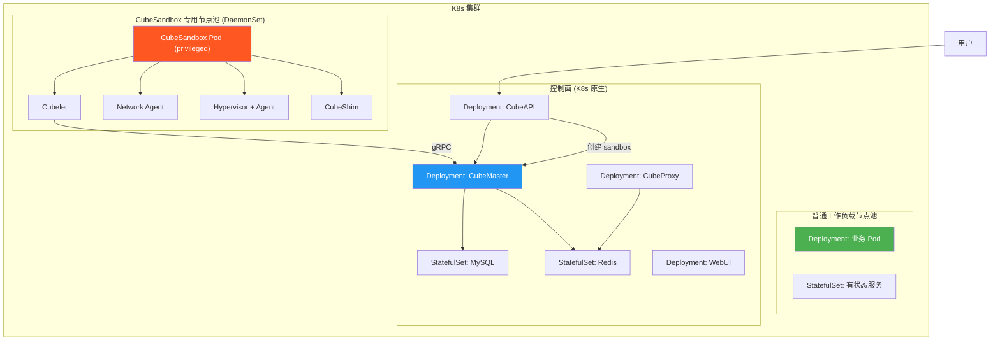

# CubeSandbox Kubernetes 部署可行性分析

本文档基于代码级分析，评估在 K8s 集群中混合部署 CubeSandbox 的可行性、关键约束和推荐架构。

---

## 结论

**可行，但需要专用节点，不能与普通 Pod 混部。**

CubeSandbox 的设计本质上是一个裸机/VM 级别的基础设施服务，对宿主机的侵入程度远超 K8s 的安全模型。混合部署的唯一可行方案是：将 CubeSandbox 计算面部署在专用的 DaemonSet 节点上，与普通 K8s 工作负载物理隔离。

---

## 九个关键因素分析

### 1. KVM 硬件虚拟化（硬性要求）

CubeSandbox 的 Hypervisor 是 Cloud Hypervisor 的 fork，直接通过 `kvm_ioctls` crate 操作 `/dev/kvm`（`hypervisor/src/kvm/mod.rs:968`）。每个 sandbox 都是一个独立的 KVM MicroVM。

- **影响**：节点必须有 `/dev/kvm`，且需要嵌套虚拟化或裸金属节点
- **K8s 兼容性**：云托管 K8s（EKS/GKE/AKS）通常不暴露 KVM 给 Pod。必须使用裸金属节点或支持嵌套虚拟化的实例
- **与 Kata 冲突**：如果集群已有 Kata Containers，两者会竞争 KVM 资源

### 2. 宿主机网络栈侵入（最大冲突点）

CubeSandbox 对宿主机网络做了大量修改，与 K8s CNI 直接冲突：

| 操作 | 代码位置 | 冲突 |
|------|---------|------|
| 在 `eth0` ingress 附加 eBPF TC filter | `CubeNet/cubevs/miscs.go:124` | 与 Calico/Cilium 的 TC filter 冲突 |
| 在 `lo` ingress 附加 eBPF TC filter | `CubeNet/cubevs/miscs.go:127` | 拦截所有 loopback 流量 |
| 创建 `cube-dev` dummy 接口 | `network-agent/netdevice.go:192` | 污染宿主机网络命名空间 |
| 创建数百个 TAP 设备（`z{IP}`） | `network-agent/netdevice.go:316` | 占用宿主机网络设备表 |
| 添加静态路由 `192.168.0.0/18` | `network-agent/netdevice.go:290` | 可能与 K8s Pod CIDR 重叠 |
| 修改 `ip_local_port_range` | `network-agent/local_service.go:118` | 全局影响所有进程 |
| 重写 `/etc/resolv.conf` | `deploy/scripts/dns-host-route-up.sh` | 与 kubelet DNS 管理冲突 |
| 在 `/sys/fs/bpf/` pin BPF map | `CubeNet/cubevs/cubevs.go:104` | 可能与 eBPF CNI 的 map 名称冲突 |

**结论**：CubeSandbox 必须运行在 `hostNetwork: true` 的 Pod 中，且节点不能使用 eBPF-based CNI（如 Cilium）。

### 3. XFS + Reflink 存储（硬性要求）

Cubecow 存储引擎依赖 XFS 的 reflink 特性实现 O(1) 的 sandbox 快照/克隆（`cubecow/Cargo.toml:5`）。安装脚本在 `/data/cubelet` 不是 XFS 时直接拒绝（`install.sh:168-202`）。

- **影响**：需要专用的 XFS 格式 volume，且挂载时启用 `-m reflink=1`
- **K8s 兼容性**：标准 PVC（EBS、Azure Disk）默认不是 XFS，也不一定支持 reflink。需要本地 SSD + 手动格式化，或使用 `local-path-provisioner` 配合 XFS

### 4. 设备访问（硬性要求）

| 设备 | 用途 | 代码位置 |
|------|------|---------|
| `/dev/kvm` | KVM 虚拟化 | `hypervisor/src/kvm/mod.rs:968` |
| `/dev/net/tun` | TAP 设备创建 | `network-agent/netdevice.go:41` |
| `/dev/vhost-net` | 可选，virtio-net 加速 | `hypervisor/vmm/src/vm_config.rs:298` |
| `/dev/vhost-vsock` | 可选，vsock 通信 | 同上 |

- **K8s 兼容性**：需要 `resources.limits` 中声明设备，或使用 `privileged: true`

### 5. Linux Capabilities（硬性要求）

CubeSandbox 需要的 capabilities 远超 K8s 标准安全策略：

| Capability | 用途 |
|-----------|------|
| `CAP_SYS_ADMIN` | eBPF 加载、cgroup 管理、mount namespace |
| `CAP_NET_ADMIN` | TAP 创建、路由/ARP 操作、TC filter |
| `CAP_NET_RAW` | `SO_BINDTODEVICE`、原始套接字 |
| `CAP_BPF` | eBPF 程序加载和 map 操作 |

- **K8s 兼容性**：Pod 必须 `privileged: true`，完全绕过 K8s 安全边界

### 6. cgroup v2 管理（硬性要求）

Cubelet 需要 `Delegate=yes` 来获取 cgroup 子树的控制权（`cube-sandbox-cubelet.service:16`），并写入 `/sys/fs/cgroup/cgroup.subtree_control` 启用 `cpu` controller（`install.sh:204-245`）。

- **冲突**：K8s kubelet 管理 cgroup 层级结构。CubeSandbox 期望在根级别创建自己的 cgroup 子树，与 kubelet 的 cgroup 管理冲突
- **解决**：需要节点级别的 cgroup 配置调整，让 kubelet 和 CubeSandbox 共享 cgroup v2 层级

### 7. systemd 依赖（架构性问题）

CubeSandbox 的所有组件通过 systemd 管理，包括 12 个 service unit 和 2 个 target。MySQL、Redis、CubeProxy、CoreDNS、WebUI 全部以 Docker 容器方式由 systemd 启动。

- **冲突**：K8s Pod 内没有 systemd（PID 1 是容器自己的 init）
- **解决**：要么在容器内运行 systemd（不推荐），要么将组件拆分为独立 K8s Deployment

### 8. 控制面组件的 K8s 化潜力

控制面组件可以原生部署为 K8s 资源：

| 组件 | K8s 部署方式 | 改造难度 |
|------|-------------|---------|
| MySQL | StatefulSet + PVC | 低 |
| Redis | StatefulSet 或 K8s Redis Operator | 低 |
| CubeMaster | Deployment（Go binary） | 中 |
| CubeAPI | Deployment（Rust binary） | 中 |
| CubeProxy | Deployment（OpenResty） | 中 |
| CoreDNS | 使用 K8s 原生 CoreDNS 或自定义 ConfigMap | 低 |
| WebUI | Deployment | 低 |

但计算面组件（Cubelet、Network Agent、CubeShim、Hypervisor）无法原生 K8s 化，因为它们深度依赖宿主机。

### 9. 端口范围冲突

Network Agent 将系统临时端口范围改为 `10000-19999`（`local_service.go:118`），自身分配 host port 在 `20000-29999` 范围（`port_allocator.go:16`）。与 K8s NodePort 默认范围 `30000-32767` 不重叠，但可能影响节点上其他应用。

---

## 推荐的 K8s 部署架构



### 专用节点要求

- 裸金属节点或支持嵌套虚拟化的 VM
- 本地 XFS SSD（reflink=1），挂载到 `/data/cubelet`
- 节点标签 `node-role.kubernetes.io/cubesandbox: ""`
- taint `cubesandbox=true:NoSchedule` 防止普通 Pod 调度上来
- Pod 配置：`privileged: true`, `hostNetwork: true`, `hostPID: true`
- 设备挂载：`/dev/kvm`, `/dev/net/tun`
- CNI 选择：避免 eBPF-based CNI（如 Cilium），推荐 Flannel 或 Calico（iptables 模式）

### DaemonSet 配置要点

```yaml
apiVersion: apps/v1
kind: DaemonSet
metadata:
  name: cubesandbox-compute
  namespace: cubesandbox
spec:
  selector:
    matchLabels:
      app: cubesandbox-compute
  template:
    metadata:
      labels:
        app: cubesandbox-compute
    spec:
      nodeSelector:
        node-role.kubernetes.io/cubesandbox: ""
      tolerations:
      - key: cubesandbox
        operator: Equal
        value: "true"
        effect: NoSchedule
      hostNetwork: true
      hostPID: true
      containers:
      - name: cubesandbox
        image: cubesandbox:latest
        securityContext:
          privileged: true
        volumeMounts:
        - name: dev-kvm
          mountPath: /dev/kvm
        - name: dev-tun
          mountPath: /dev/net/tun
        - name: data-cubelet
          mountPath: /data/cubelet
        - name: sys-fs-bpf
          mountPath: /sys/fs/bpf
      volumes:
      - name: dev-kvm
        hostPath:
          path: /dev/kvm
      - name: dev-tun
        hostPath:
          path: /dev/net/tun
      - name: data-cubelet
        hostPath:
          path: /data/cubelet
      - name: sys-fs-bpf
        hostPath:
          path: /sys/fs/bpf
```

---

## 现状评估

当前仓库中不存在任何 K8s 部署文件、Helm Chart 或 Kustomize 配置。整个部署模型基于裸机/VM + systemd + Docker Compose。要实现 K8s 部署，需要：

1. 为控制面组件编写 K8s Deployment/StatefulSet manifests
2. 为计算面组件编写 DaemonSet manifests
3. 将 systemd 服务逻辑迁移为容器 entrypoint 脚本
4. 处理 cgroup v2 层级与 kubelet 的协调
5. 验证 eBPF 程序与 K8s CNI 的共存

---

## 总结

| 因素 | 可行性 | 说明 |
|------|--------|------|
| KVM 设备 | 需裸金属/嵌套虚拟化节点 | 云托管 K8s 通常不可用 |
| 网络隔离 | 必须专用节点 | eBPF 与 K8s CNI 冲突 |
| 存储 | 需本地 XFS SSD | 标准 PVC 不支持 reflink |
| 安全模型 | 必须 privileged | 完全绕过 K8s 安全边界 |
| cgroup | 需节点级配置 | 与 kubelet cgroup 管理冲突 |
| 控制面 | 可 K8s 原生化 | 改造难度中等 |
| 计算面 | 无法 K8s 原生化 | 必须 DaemonSet + 特权模式 |

K8s 可以作为 CubeSandbox 的编排层，但计算面节点本质上还是裸机部署，K8s 只提供了统一的 API 和控制面管理能力。真正的"混合部署"是指控制面用 K8s Deployment，计算面用 DaemonSet + 专用节点，两者通过 K8s Service 通信。
