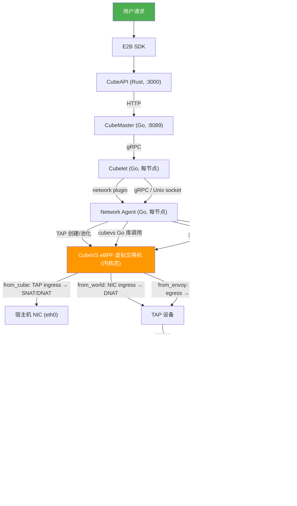
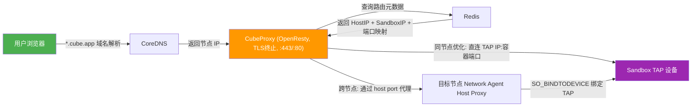

# CubeSandbox 网络方案深度解析

本文档基于代码级分析，详尽阐述 CubeSandbox 的网络架构设计与实现。

---

## 目录

1. [架构总览](#1-架构总览)
2. [核心组件](#2-核心组件)
3. [数据面：报文流转路径](#3-数据面报文流转路径)
4. [控制面：Sandbox 生命周期中的网络操作](#4-控制面sandbox-生命周期中的网络操作)
5. [CubeVS eBPF 虚拟交换机](#5-cubevs-ebpf-虚拟交换机)
6. [Network Agent](#6-network-agent)
7. [Cubelet 网络插件](#7-cubelet-网络插件)
8. [CubeProxy 反向代理](#8-cubeproxy-反向代理)
9. [DNS 解析](#9-dns-解析)
10. [Hypervisor virtio-net 与 TAP 设备](#10-hypervisor-virtio-net-与-tap-设备)
11. [CubeShim 网络桥接](#11-cubeshim-网络桥接)
12. [IP 地址管理](#12-ip-地址管理)
13. [端口映射](#13-端口映射)
14. [网络策略（防火墙）](#14-网络策略防火墙)
15. [NAT 会话跟踪](#15-nat-会话跟踪)
16. [BPF Map 清单](#16-bpf-map-清单)
17. [关键设计决策](#17-关键设计决策)

---

## 1. 架构总览

CubeSandbox 的网络方案**不使用**传统容器网络模型（veth pair + network namespace + iptables/CNI）。取而代之的是一套完全基于 **TAP 设备 + eBPF TC filter** 的自研方案，由以下组件协作完成：



外部访问路径：



---

## 2. 核心组件

| 组件 | 语言 | 位置 | 职责 |
|------|------|------|------|
| **CubeVS** | Go + eBPF C | `CubeNet/cubevs/`, `CubeNet/src/` | 内核态虚拟交换机，处理 NAT、会话跟踪、网络策略 |
| **Network Agent** | Go | `network-agent/` | 节点级网络编排：TAP 创建/池化、eBPF 注册、端口代理、崩溃恢复 |
| **Cubelet Network Plugin** | Go | `Cubelet/network/` | 调用 Network Agent，构建 ShimNetReq，管理分配存储 |
| **CubeProxy** | Lua/OpenResty | `CubeProxy/` | 反向代理，TLS 终止，基于 Redis 的 sandbox 路由 |
| **CoreDNS** | Go | `deploy/one-click/coredns/` | `*.cube.app` 域名解析，泛域名指向节点 IP |
| **CubeShim** | Rust | `CubeShim/` | 读取 OCI annotation 中的网络配置，传递给 Hypervisor |
| **Hypervisor** | Rust | `hypervisor/` | virtio-net 设备，通过 TAP fd 收发以太网帧 |
| **Agent** | Rust | `agent/` | Guest 内 PID 1，配置 IP/路由/ARP/DNS |
| **CubeMaster** | Go | `CubeMaster/` | 写入 Redis sandbox 路由元数据（`bypass_host_proxy:<id>`） |

---

## 3. 数据面：报文流转路径

### 3.1 Sandbox → 外部世界（Egress）

数据路径：Guest 应用 → guest 内核 → virtio-net → TAP fd → **`from_cube` eBPF 程序** → 宿主机 NIC

`from_cube` 程序（`CubeNet/src/mvmtap.bpf.c`，`from_cube` 函数，line 440）的处理逻辑：

1. **ARP 处理**（line 458-459）：Sandbox 发出的 ARP 请求由 eBPF 代理应答，返回 `cubegw0` 的 MAC 地址（`20:90:6f:cf:cf:cf`）。`handle_arp()` 函数（line 28-91）执行 ARP 欺骗，使 sandbox 认为网关在本地链路上。

2. **网关流量过滤**（line 479-505）：如果目的 IP 是 MVM 网关（`169.254.68.5`），只允许 ICMP 和非 SYN 的 TCP（SYN 包被丢弃），然后 DNAT 到 `cubegw0_ip` 并重定向到 `cubegw0` 接口。

3. **端口映射 TCP**（line 507-521）：如果源端口匹配 `local_port_mapping` 表项，说明这是入站端口转发的回程流量，执行 SNAT（源端口替换为宿主机端口）后重定向到宿主机 NIC。

4. **网络策略检查**（line 524-525）：`check_net_policy()`（line 121-151）评估 allow/deny 列表。流量到网关 IP 始终允许；否则 `allow_out` 优先于 `deny_out`。

5. **NAT 与重定向**（line 531-543）：对 TCP/UDP/ICMP 执行 SNAT——源 IP 从 sandbox IP（`169.254.68.6`）替换为 SNAT IP，源端口替换为 SNAT 端口（从 30000 开始递增），L2 头改写为宿主机 NIC 的 MAC，然后重定向到宿主机 NIC 的 ifindex。

```
Guest (169.254.68.6:随机端口) → 外部 (8.8.8.8:53)
    ↓ TAP ingress
from_cube:
    1. ARP 代理应答
    2. 网络策略检查 (allow_out/deny_out)
    3. SNAT: src=SNAT_IP:30001, dst=8.8.8.8:53
    4. L2 改写: src_mac=NIC_mac, dst_mac=next_hop_mac
    5. redirect to NIC ifindex
    ↓
宿主机 NIC (eth0) → 外部网络
```

### 3.2 外部世界 → Sandbox（Ingress）

数据路径：外部网络 → 宿主机 NIC → **`from_world` eBPF 程序** → TAP fd → virtio-net → Guest

`from_world` 程序（`CubeNet/src/nodenic.bpf.c`，`from_world` 函数，line 247）附加在 `eth0` 和 `lo` 的 ingress 上：

1. **TCP 端口映射**（`do_tcp_nat`，line 224）：首先检查 `remote_port_mapping` 表，如果宿主机端口有映射，执行 DNAT 到 sandbox 的监听端口，通过 `tcp_nat_proxy()`（line 18-41）完成。

2. **会话查找**：查询 `ingress_sessions` → `egress_sessions` 找到原始会话，DNAT 目的地址恢复为 sandbox 的 IP:端口。

3. **重定向**：将报文重定向到 sandbox TAP 的 ifindex。

```
外部 (8.8.8.8:53) → 宿主机 NIC
    ↓ NIC ingress
from_world:
    1. 查找 ingress_sessions (反向五元组)
    2. 找到对应 egress_sessions (原始五元组)
    3. DNAT: dst=169.254.68.6:随机端口
    4. redirect to TAP ifindex
    ↓
TAP → virtio-net → Guest
```

### 3.3 Envoy/本地代理 → Sandbox

数据路径：`cubegw0` dummy 接口 → **`from_envoy` eBPF 程序** → TAP fd → Guest

`from_envoy` 程序（`CubeNet/src/localgw.bpf.c`，`from_envoy` 函数，line 18）附加在 `cubegw0` 的 egress 上：

1. DNAT 目的地址到 `mvm_inner_ip`（`169.254.68.6`）
2. SNAT 源地址到 `mvm_gateway_ip`（`169.254.68.5`）
3. 查找 `mvmip_to_ifindex` 得到原始目的 IP 对应的 TAP ifindex
4. 重定向到 sandbox TAP

### 3.4 Sandbox → Sandbox（同节点）

两个 sandbox 在同一节点上通信时，报文经过 `from_cube`（sandbox A 的 TAP）→ SNAT → `from_world`（宿主机 NIC ingress）→ DNAT → sandbox B 的 TAP。由于 `lo` 接口也附加了 `from_world`，回程流量可以走 loopback。

### 3.5 Sandbox → Sandbox（跨节点）

跨节点通信走标准的 egress → 物理网络 → ingress 路径，经过宿主机 NIC 的 SNAT 后通过物理网络到达目标节点，再由目标节点的 `from_world` 完成 DNAT。

---

## 4. 控制面：Sandbox 生命周期中的网络操作

### 4.1 Sandbox 创建时的网络流程

完整的调用链（从用户请求到网络就绪）：

```
1. 用户调用 E2B SDK → CubeAPI (:3000)
2. CubeAPI → CubeMaster HTTP (:8089)
3. CubeMaster:
   a. 调度选择节点
   b. 写入 Redis: HSET bypass_host_proxy:<id> (HostIP, SandboxIP, ContainerToHostPorts)
   c. gRPC 调用 Cubelet (:9999)
4. Cubelet workflow engine 执行 create 流水线:
   Step 1: createid, appsnapshot
   Step 2: images, volume, storage, NETWORK, netfile, cube-sandbox-store  ← 网络在这里
   Step 3: cgroup
   Step 4: cubebox
```

**Step 2 中网络插件的具体执行**（`Cubelet/network/plugin_tap.go`，`local.Create()`，line 429-521）：

```
4a. 从 OCI annotation "cube.master.net" 解码 NetRequest
4b. 构建 CubeVSContext（防火墙策略）
    - block_all=true → AllowInternetAccess=false
    - allow_public_services=true → AllowInternetAccess=true
4c. 解析 DNS 服务器
4d. 如果限制了外网访问，将 DNS 服务器 IP 合并到 AllowOut
4e. 构建 EnsureNetworkRequest:
    - interface: MAC, MTU, IP/CIDR, gateway
    - routes: 默认路由 via gateway
    - arp: 网关的静态 ARP 表项
    - port_mappings: 容器端口列表
    - CubeVSContext: 防火墙规则
4f. 调用 networkAgentClient.EnsureNetwork()  ← 发送到 Network Agent
4g. 失败时回滚: networkAgentClient.ReleaseNetwork()
4h. 成功后从响应构建 ShimNetReq
4i. 通过 Unix socket SCM_RIGHTS 获取 TAP fd
4j. 注册 TAP 到内存池 (ID2MvmNet, Name2MvmNet)
4k. 设置 opts.NetworkInfo = ShimNetReq
```

**Network Agent 收到 EnsureNetwork 后**（`network-agent/internal/service/local_service.go`，`createStateLocked()`，line 275-348）：

```
5a. 确保宿主机路由: ip route add 192.168.0.0/18 dev cube-dev
5b. 从 TAP 池 dequeue 或新建 TAP
5c. 如果 TAP 池为空:
    - 从 bitmap 分配器获取 IP
    - 创建 TAP 设备 (z{IP}, 如 z192.168.0.40)
    - 设置 IFF_TAP | IFF_NO_PI | IFF_VNET_HDR | IFF_ONE_QUEUE
    - 设置 virtio-net header size = 12
    - 设置 MTU = 1300
    - 附加 eBPF filter (from_cube) 到 TAP ingress
    - 添加永久 ARP 表项
5d. 配置端口映射: cubevsAddPortMap() → 注册到 eBPF remote/local_port_mapping
5e. 注册 TAP 到 CubeVS: cubevsAddTAPDevice() → 写入 eBPF ifindex_to_mvmmeta + mvmip_to_ifindex
5f. 持久化状态到 JSON 文件
```

**CubeShim 接收到网络配置后**（`CubeShim/shim/src/hypervisor/config.rs`，line 236-264）：

```
6a. 从 OCI annotation "cube.net" 读取 Net 结构体
6b. 为每个 interface 创建 NetConfig:
    - tap = TAP 设备名（如 "z192.168.0.40"）
    - mac = sandbox MAC
6c. 传递给 Hypervisor 的 create_vm()
```

**Hypervisor 启动 VM 时**（`hypervisor/vmm/src/device_manager.rs`，line 2359-2475）：

```
7a. 设备管理器检查 NetConfig:
    - 有 fds? → Net::from_tap_fds() (直接包装 fd)
    - 有 tap name? → Net::new() → open_tap()
7b. open_tap() 优先走 TAP 池快速路径:
    - 连接 /data/cubelet/cubetap.sock
    - 发送 {name, sandboxId}
    - 通过 SCM_RIGHTS 接收 TAP fd
    - 失败则回退到直接打开 /dev/net/tun
7c. 创建 virtio-net 设备:
    - TX: guest → writev() → TAP fd
    - RX: readv() TAP fd → guest memory
    - epoll 事件驱动
```

**Guest 内 Agent 配置网络**（`agent/`）：

```
8a. Agent 作为 PID 1 启动
8b. 从 CreateSandboxRequest 读取 interfaces/routes/arps
8c. 配置:
    - ip addr add 169.254.68.6/30 dev eth0
    - ip link set eth0 up
    - ip route add default via 169.254.68.5
    - ip neigh add 169.254.68.5 lladdr 20:90:6f:cf:cf:cf dev eth0 nud permanent
    - 写入 /etc/resolv.conf, /etc/hosts, /etc/hostname
```

### 4.2 Sandbox 销毁时的网络流程

```
1. Cubelet workflow engine 执行 destroy 流水线:
   Step 1: cubebox
   Step 2: images, storage, cgroup, NETWORK, volume, netfile, cube-sandbox-store
   Step 3: cleanup

2. network plugin Destroy() (plugin_tap.go:677-720):
   a. 获取 per-sandbox destroy lock
   b. 从内存加载 MvmNet
   c. 调用 networkAgentClient.ReleaseNetwork()

3. Network Agent ReleaseNetwork() (local_service.go:406-430):
   a. 关闭所有 host proxy
   b. 清除 eBPF 端口映射: cubevsDelPortMap()
   c. 从 eBPF 移除 TAP: cubevsDelTAPDevice()
   d. 回收 TAP 到池（不销毁）
   e. 删除持久化状态文件

4. Cubelet:
   a. 从 ID2MvmNet/Name2MvmNet 移除
   b. 关闭 TAP fd
   c. 从 BoltDB 删除 NetworkAllocation
```

### 4.3 崩溃恢复

Network Agent 在启动时执行恢复（`local_service.go`，`recover()`，line 432-542）：

```
1. 加载所有持久化状态文件
2. 列出宿主机上所有现有 TAP 设备 (netlink.LinkList)
3. 列出所有存活的 CubeVS eBPF map 条目
4. 列出所有存活的端口映射
5. 对每个 TAP:
   - 有持久化状态? → 恢复 TAP fd，reconcile eBPF 状态，重新添加 ARP
   - 无状态但 CubeVS 标记 InUse? → 从 TAP + CubeVS 数据重建状态
   - 都无? → 清理 CubeVS 条目，回收到池
6. 对持久化状态中 TAP 已不存在的: 清理 eBPF 条目，删除状态文件
7. 预分配 TAP 填充池到 TapInitNum
```

---

## 5. CubeVS eBPF 虚拟交换机

### 5.1 架构

CubeVS 是一个纯 Go 库（`CubeNet/cubevs/`），通过 **TC (Traffic Control) clsact qdisc** 附加 BPF filter 实现内核态包处理。不使用 XDP。

三个 eBPF 程序编译自三个独立的 C 源文件：

| 程序名 | 源文件 | 附加点 | 方向 | 用途 |
|--------|--------|--------|------|------|
| `from_envoy` | `CubeNet/src/localgw.bpf.c` | `cubegw0` (cube-dev) | Egress | 从 envoy 到 sandbox TAP 的 DNAT+SNAT |
| `from_cube` | `CubeNet/src/mvmtap.bpf.c` | 每个 sandbox TAP | Ingress | sandbox 出站流量的 SNAT+重定向 |
| `from_world` | `CubeNet/src/nodenic.bpf.c` | `eth0` + `lo` | Ingress | 入站流量到 sandbox TAP 的 DNAT |

初始化流程（`CubeNet/cubevs/miscs.go`，`Init()`，line 92-130）：

```go
func Init(params Params) error {
    // 加载三个 eBPF 对象，重写常量（IP、MAC 等）
    loadObject(params, loadLocalgw, "loadLocalgw")
    loadObject(params, loadMvmtap, "loadMvmtap")
    loadObject(params, loadNodenic, "loadNodenic")
    // 附加 TC filter
    attachTCFilter("from_envoy", cubegw0_ifindex, TCEgress)  // cubegw0 egress
    attachTCFilter("from_world", node_ifindex, TCIngress)     // eth0 ingress
    attachTCFilter("from_world", 1, TCIngress)                 // lo ingress
}
```

### 5.2 常量重写

eBPF 程序中的 IP/MAC 地址是 `const volatile` 变量，在加载时由 Go 层通过 `rewriteConstants()`（`miscs.go`，line 16-33）重写为实际值：

```c
// CubeNet/src/cubevs.h, line 63-84
const volatile __u32 mvm_inner_ip     = 0x0644fea9; // 169.254.68.6
const volatile __u32 mvm_gateway_ip   = 0x0544fea9; // 169.254.68.5
const volatile __u32 cubegw0_ip       = 0x017100CB; // 203.0.113.1
const volatile __u32 node_ip          = 0x020a8709; // 9.135.10.2
```

### 5.3 TC 附加机制

TC filter 附加在 `CubeNet/cubevs/tc.go` 中实现：

1. 创建 `clsact` qdisc（line 23-38）
2. 附加 BPF filter 带 `direct-action` 标志（line 43-75）
3. 使用 `florianl/go-tc` 库的 netlink 接口

### 5.4 TAP 设备注册

`AddTAPDevice()`（`CubeNet/cubevs/tap.go`，line 44）写入两个 BPF map：

- `ifindex_to_mvmmeta`：TAP ifindex → MVM 元数据（IP、UUID、version）
- `mvmip_to_ifindex`：MVM IP → TAP ifindex

然后调用 `applyNetPolicy()` 设置 per-sandbox 防火墙规则。

`AttachFilter()`（`miscs.go`，line 133）将 `from_cube` BPF 程序附加到 TAP ingress，并初始化网络策略 map。

---

## 6. Network Agent

### 6.1 gRPC API

定义在 `network-agent/api/v1/network_agent.proto`：

```protobuf
service NetworkAgent {
  rpc EnsureNetwork(EnsureNetworkRequest) returns (EnsureNetworkResponse);
  rpc ReleaseNetwork(ReleaseNetworkRequest) returns (ReleaseNetworkResponse);
  rpc ReconcileNetwork(ReconcileNetworkRequest) returns (ReconcileNetworkResponse);
  rpc GetNetwork(GetNetworkRequest) returns (GetNetworkResponse);
  rpc Health(HealthRequest) returns (HealthResponse);
  rpc ListNetworks(ListNetworksRequest) returns (ListNetworksResponse);
}
```

默认监听地址：
- gRPC: `unix:///tmp/cube/network-agent-grpc.sock`
- HTTP: `unix:///tmp/cube/network-agent.sock`
- Health: `127.0.0.1:19090`
- TAP FD: `unix:///tmp/cube/network-agent-tap.sock`

### 6.2 TAP 设备创建

`newTap()`（`network-agent/internal/service/netdevice.go`，line 316-381）：

```go
// 创建 TAP 设备
flags := netlink.TUNTAP_MODE_TAP | unix.IFF_TAP | unix.IFF_NO_PI |
         unix.IFF_VNET_HDR | unix.IFF_ONE_QUEUE
// 设置 virtio-net header size = 12
ioctl(tapFd, TUNSETVNETHDRSZ, 12)
// 设置 MTU
netlink.LinkSetMTU(link, 1300)
// 附加 eBPF filter
cubevs.AttachFilter(ifindex)
// 添加永久 ARP 表项
netlink.NeighSet(&netlink.Neigh{IP: sandboxIP, MAC: mac, State: NUD_PERMANENT})
```

TAP 命名规则：`z{IP}`，如 `z192.168.0.40`。

### 6.3 TAP 池化

TAP 池（`tap_lifecycle.go`）预分配和回收 TAP 设备以避免创建延迟：

- `enqueueTapLocked()`（line 35）：归还 TAP 到池
- `dequeueTapLocked()`（line 54）：从池中取出 TAP
- `ensureTapInventory()`（line 157）：预创建 TAP 到 `TapInitNum`
- 维护循环每 5 秒运行（line 177），处理异常 TAP（最多重试 3 次后隔离）

### 6.4 TAP FD 传递

Network Agent 通过 Unix socket 的 `SCM_RIGHTS` 机制将 TAP fd 传递给 Cubelet/Hypervisor：

FD Server（`network-agent/internal/fdserver/server.go`，line 107）：
```go
syscall.Sendmsg(conn, nil, syscall.UnixRights(int(file.Fd())), nil, 0)
```

Hypervisor 端通过 TAP 池服务接收 fd（`hypervisor/net_util/src/tap.rs`，line 213-229）：
```rust
// 连接 /data/cubelet/cubetap.sock
// 发送 JSON {name, sandboxId}
// 通过 recv_with_fds() 接收 TAP fd
```

### 6.5 Host Proxy

`hostproxy.go`（line 26-108）实现 TCP 级别的端口代理：

```go
func (p *hostProxy) handleConn(conn net.Conn) {
    // 绑定到 TAP 设备
    rawConn.Syscall(func(fd uintptr) {
        syscall.SetsockoptString(int(fd), SOL_SOCKET, SO_BINDTODEVICE, tapName)
    })
    // 连接到 sandbox
    backend := net.Dial("tcp", fmt.Sprintf("%s:%d", guestIP, guestPort))
    // 双向拷贝
    go io.Copy(conn, backend)
    io.Copy(backend, conn)
}
```

端口分配范围：20000-29999（`port_allocator.go`，line 16-17）。系统启动时将 `ip_local_port_range` 设置为 10000-19999 以避免冲突。

### 6.6 状态持久化与恢复

每个 sandbox 的状态持久化为 JSON 文件（`state_store.go`），包含：sandbox ID、TAP 名称/ifindex、IP、接口、路由、ARP、端口映射、CubeVSContext、元数据。

---

## 7. Cubelet 网络插件

### 7.1 架构

Cubelet 使用 `delegateNetworkManager`（`Cubelet/network/plugin.go`）编排网络生命周期，委托给 `local` 结构体（`plugin_tap.go`）执行实际的 TAP 网络操作。

关键设计：**不使用 CNI**。CNI 仅存在于遗留的 CRI sandbox 元数据层中，实际网络完全通过 TAP + Network Agent 架构实现。

### 7.2 网络请求构建

`local.Create()`（`plugin_tap.go`，line 429-521）构建 `EnsureNetworkRequest`：

```go
req := &EnsureNetworkRequest{
    SandboxID: sandboxID,
    Interfaces: []Interface{{
        MAC:      mac,
        MTU:      1300,
        IP:       "192.168.0.40",
        CIDR:     "192.168.0.40/18",
        Gateway:  "192.168.0.1",
    }},
    Routes: []Route{{
        Gateway: "192.168.0.1",
        Device:  "z192.168.0.40",
    }},
    ARPs: []ARPNeighbor{{
        IP:      "192.168.0.1",
        MAC:     "20:90:6f:cf:cf:cf",
        Device:  "z192.168.0.40",
    }},
    PortMappings: []PortMapping{
        {Protocol: "tcp", HostIP: "127.0.0.1", ContainerPort: 8080},
        {Protocol: "tcp", HostIP: "127.0.0.1", ContainerPort: 49983},
    },
    CubeVSContext: &CubeVSContext{
        AllowInternetAccess: boolPtr(true),
        AllowOut:            []string{"8.8.8.8/32"},
        DenyOut:             []string{},
    },
}
```

### 7.3 cube-dev dummy 设备

`plugin_tap.go`（line 130-189）在初始化时创建 `cube-dev` dummy 接口：

- 类型：Linux Dummy interface
- 名称：`cube-dev`
- IP：网关 IP（如 `192.168.0.1/18`）
- MAC：网关 MAC（`20:90:6f:cf:cf:cf`）
- 用途：作为所有 sandbox 流量的宿主机端 ARP 应答端点

### 7.4 OCI Annotation 传递

网络配置通过 OCI annotation 传递给 CubeShim（`Cubelet/network/proto/network.go`，line 135-141）：

```go
func (s *ShimNetReq) OCISpecOpts() oci.SpecOpts {
    b, _ := json.Marshal(s)
    return oci.WithAnnotations(map[string]string{
        "cube.net": string(b),
    })
}
```

TAP fd 通过单独的 Unix socket SCM_RIGHTS 机制传递（不通过 OCI annotation）。

### 7.5 DNS Allow-Out 合并

当 sandbox 限制了外网访问但配置了 DNS 服务器时（`plugin_tap.go`，line 599-675），DNS 服务器 IP 会自动合并到 `AllowOut` CIDRs 中，确保 sandbox 仍能解析域名：

```go
for _, dns := range dnsServers {
    if isIPv4(dns) {
        allowOut = append(allowOut, dns+"/32")
    } else {
        allowOut = append(allowOut, dns+"/128")
    }
}
```

---

## 8. CubeProxy 反向代理

### 8.1 架构

CubeProxy 基于 OpenResty（Nginx + Lua），暴露两个端口：

- **:8080（HTTPS/TLS）**：主入口，TLS 终止，支持 host-based 和 path-based 路由
- **:8081（HTTP）**：纯 HTTP，支持 path-based 路由

### 8.2 路由方式

**Host-based 路由**（默认 `location /`）：

URL 格式：`<container_port>-<sandbox_id>.cube.app`

例如：`49983-7c8fbcd45ffe450fb8f7fb223ad45507.cube.app`

`rewrite_phase.lua` 解析 Host header 提取 `container_port` 和 `ins_id`。

**Path-based 路由**（`location ^~ /sandbox/`）：

URL 格式：`/sandbox/<sandbox-id>/<container-port>/<rest>`

`path_rewrite_phase.lua` 解析 URI，剥离前缀，重写上游 URI 为 `/<rest>`。

### 8.3 后端解析

`sandbox_backend.lua` 的 `resolve_backend()` 函数（line 71-130）：

1. 检查本地 shared dict 缓存（TTL 500-700 秒随机化）
2. 缓存未命中时查询 Redis：`HGETALL bypass_host_proxy:<sandbox_id>`
3. Redis hash 包含：`HostIP`、`SandboxIP`、`CreatedAt`、`ContainerToHostPorts`
4. **同节点优化**（line 110）：如果 CubeProxy 的 IP == `HostIP`，直接路由到 sandbox TAP IP 的容器端口
5. **跨节点路由**（line 121）：路由到目标宿主机 IP 的映射宿主机端口

```lua
-- 同节点: 直连 TAP IP
backend_ip = sandbox_ip
backend_port = container_port

-- 跨节点: 通过 host port 代理
backend_ip = host_ip
backend_port = container_to_host_ports[container_port]
```

### 8.4 TLS 终止

证书由 `mkcert` 生成：

```bash
mkcert cube.app "*.cube.app" localhost 127.0.0.1
```

生成 `cube.app+3.pem` 和 `cube.app+3-key.pem`，挂载到 CubeProxy 容器的 `/usr/local/openresty/nginx/certs/`。

### 8.5 WebSocket 支持

```nginx
proxy_http_version 1.1;
proxy_set_header Upgrade $http_upgrade;
proxy_set_header Connection "upgrade";
```

超时配置：发送/读取超时 7206 秒（2 小时），连接超时 3 秒。

---

## 9. DNS 解析

### 9.1 CoreDNS 配置

`deploy/one-click/coredns/Corefile.template`：

```
.:53 {
    bind __COREDNS_BIND_ADDR__
    template IN A cube.app {
        answer "{{ .Name }} 60 IN A __CUBE_PROXY_DNS_ANSWER_IP__"
        fallthrough
    }
    template IN A (.*)\.cube\.app {
        answer "{{ .Name }} 60 IN A __CUBE_PROXY_DNS_ANSWER_IP__"
        fallthrough
    }
    forward . /etc/resolv.conf
}
```

所有 `*.cube.app` 的 A 记录都解析到节点 IP（CubeProxy 所在节点）。

### 9.2 宿主机 DNS 路由

支持两种后端：

**systemd-resolved**（优先）：
- 创建 dummy 接口 `cube-dns0`（IP: `169.254.254.53/32`）
- `resolvectl domain cube-dns0 '~cube.app'`
- `resolvectl default-route cube-dns0 no`

**NetworkManager + dnsmasq**（回退）：
- dnsmasq 监听 `127.0.0.1` 和 `169.254.254.53`
- `server=/cube.app/127.0.0.54#53`
- 重写 `/etc/resolv.conf` 指向 `169.254.254.53`

关键设计：`169.254.254.53` 是 dummy 接口上的非 loopback 地址，Docker 容器可以通过 docker bridge 网关访问它，确保 sandbox 容器能解析 `*.cube.app`。

---

## 10. Hypervisor virtio-net 与 TAP 设备

### 10.1 TAP 设备结构

`hypervisor/net_util/src/tap.rs`，line 68-73：

```rust
pub struct Tap {
    file: File,           // /dev/net/tun fd
    if_name: String,      // 接口名
    donated: bool,        // 是否来自外部池
}
```

打开标志：`IFF_TAP | IFF_NO_PI | IFF_VNET_HDR`（line 272），多队列时加 `IFF_MULTI_QUEUE`。

### 10.2 三种获取 TAP 的方式

1. **TAP 池快速路径**（`tap.rs`，line 213-229）：连接 `/data/cubelet/cubetap.sock`，发送 `{name, sandboxId}`，通过 SCM_RIGHTS 接收 fd
2. **直接打开**（`tap.rs`，line 231）：`open("/dev/net/tun")` + `TUNSETIFF` ioctl
3. **外部 fd**（`tap.rs`，line 300）：包装已打开的 fd，设置 `O_NONBLOCK`，获取接口名

### 10.3 数据传输

`hypervisor/net_util/src/queue_pair.rs`：

- **TX（guest → TAP）**：`TxVirtio::process_desc_chain()`（line 42）从 virtio 队列读取描述符链，`writev()` 写入 TAP fd（line 97-103）
- **RX（TAP → guest）**：`RxVirtio::process_desc_chain()`（line 183）`readv()` 读取 TAP fd（line 251-257），写入 guest 内存描述符链

epoll 事件循环（`net.rs`）：
- `RX_TAP_EVENT`：TAP 有数据可读（host → guest）
- `TX_TAP_EVENT`：TAP 可写（EAGAIN 后）
- `RX_QUEUE_EVENT`：guest 发布了新 RX buffer
- `TX_QUEUE_EVENT`：guest 有待发送的包

### 10.4 virtio 特性协商

- `VIRTIO_NET_F_MTU`
- `VIRTIO_NET_F_MAC`
- `VIRTIO_NET_F_MQ`（多队列）
- `VIRTIO_NET_F_CTRL_VQ`
- `VIRTIO_RING_F_EVENT_IDX`
- `VIRTIO_F_VERSION_1`

---

## 11. CubeShim 网络桥接

### 11.1 读取 OCI Annotation

`CubeShim/shim/src/sandbox/config.rs`，line 72-78：

```rust
let net = anno.get("cube.net")
    .map(|s| serde_json::from_str::<Net>(s))
    .unwrap_or_default();
```

### 11.2 Net 数据结构

`CubeShim/shim/src/sandbox/net.rs`，line 9-14：

```rust
struct Net {
    interfaces: Vec<Interface>,  // TAP 名称、MAC、MTU、IP
    routes: Vec<Route>,          // 网关、设备
    arps: Vec<Arp>,              // IP、MAC、设备
}
```

### 11.3 传递给 Hypervisor

`CubeShim/shim/src/hypervisor/config.rs`，line 236-264：

```rust
fn add_nets(&mut self, net: &Net) {
    for n in &net.interfaces {
        let nc = NetConfig {
            tap: n.name.clone(),  // TAP 设备名
            mac: MacAddr::from_str(&n.mac)?,
            ..Default::default()
        };
        self.devices.net.push(nc);
    }
}
```

CubeShim **不传递 TAP fd**，只传递 TAP 设备名。Hypervisor 通过名称打开 TAP（或从池获取 fd）。

### 11.4 传递给 Guest Agent

同一个 `Net` 对象转换为 protobuf 消息，通过 `CreateSandboxRequest` 发送给 guest 内的 Agent：

```rust
// sb.rs line 469-471
req.interfaces = get_pb_interfaces(&net.interfaces);
req.routes = get_pb_routes(&net.routes);
req.arps = get_pb_arps(&net.arps);
```

Agent 据此配置 guest 内核的 IP、路由和 ARP。

---

## 12. IP 地址管理

### 12.1 Sandbox IP 分配

- CIDR：`192.168.0.0/18`（16382 个可用地址）
- 分配器：bitmap allocator（`network-agent/internal/service/ipam.go`）
- TAP 命名：`z{IP}`，如 `z192.168.0.40`
- MAC 生成：`02:42:<ip-octets>`

### 12.2 内部 link-local 地址

所有 sandbox 共享同一个内部 IP：

| 角色 | IP | MAC | 说明 |
|------|-----|-----|------|
| MVM Inner IP | `169.254.68.6` | `20:90:6f:fc:fc:fc` | 每个 sandbox 内部的 IP（link-local） |
| MVM Gateway | `169.254.68.5` | - | sandbox 的下一跳网关 |
| cubegw0 | `203.0.113.1` | `20:90:6f:cf:cf:cf` | 虚拟网关设备 |
| Node NIC | 实际 IP | 实际 MAC | 宿主机物理网卡 |

### 12.3 SNAT IP 池

最多 4 个 SNAT 外部 IP（`CubeNet/src/cubevs.h`，line 32）。

SNAT IP 选择：`jhash_1word(mvm_ip, 0xebcf0700) % 4`（确定性哈希）。

端口分配：从 30000 开始递增，使用 `bpf_spin_lock` 保证原子性，到达 0xffff 后回绕。

---

## 13. 端口映射

### 13.1 双重机制

**eBPF 级别**（内核态）：
- `remote_port_mapping`：host_port → {ifindex, listen_port}
- `local_port_mapping`：{ifindex, listen_port} → host_port
- `from_world` 和 `from_cube` 程序在内核态完成端口转换

**Host Proxy**（用户态）：
- Network Agent 在 host port 上监听 TCP
- 通过 `SO_BINDTODEVICE` 绑定到 TAP 设备
- 双向 `io.Copy()` 转发流量

### 13.2 端口分配范围

- Host proxy 端口：20000-29999
- 系统临时端口：10000-19999（启动时设置 `ip_local_port_range`）
- SNAT 端口：30000-65535

### 13.3 流程

```
1. Cubelet 从 request.ExposedPorts 获取容器端口列表
2. 构建 PortMapping{Protocol: "tcp", HostIP: "127.0.0.1", ContainerPort: port}
3. Network Agent 自动分配 host port (20000-29999)
4. 注册到 eBPF maps (remote/local_port_mapping)
5. 启动 host proxy (TCP listener on host port)
6. 返回映射关系给 Cubelet
7. Cubelet 存入 ShimNetReq.PortMappings
8. 通过 OCI annotation 传递给 CubeShim
```

---

## 14. 网络策略（防火墙）

### 14.1 eBPF 实现

使用 **hash-of-maps**（`BPF_MAP_TYPE_HASH_OF_MAPS`），内层为 **LPM trie** map：

- `allow_out`：外层 key = TAP ifindex，内层 = 允许的 CIDR 列表
- `deny_out`：外层 key = TAP ifindex，内层 = 拒绝的 CIDR 列表

### 14.2 优先级逻辑

`mvmtap.bpf.c`，line 121-151：

```
allow_out 匹配? → 允许（最高优先级）
deny_out 匹配? → 拒绝
默认 → 允许
```

### 14.3 始终拒绝的 CIDR

`CubeNet/cubevs/netpolicy.go`，line 15-21：

```go
var alwaysDeniedSandboxCIDRs = []string{
    "10.0.0.0/8",      // 私有网络
    "127.0.0.0/8",     // loopback
    "169.254.0.0/16",  // link-local
    "172.16.0.0/12",   // 私有网络
    "192.168.0.0/16",  // 私有网络（包括 sandbox 自身的 CIDR）
}
```

### 14.4 Per-Sandbox 控制

通过 `MVMOptions`（`tap.go`，line 10-14）：

```go
type MVMOptions struct {
    AllowInternetAccess *bool    // 是否允许外网访问
    AllowOut            []string // CIDR 白名单
    DenyOut             []string // CIDR 黑名单
}
```

`AllowInternetAccess = false` 时，`deny_out` 设置为 `0.0.0.0/0`（拒绝所有），然后通过 DNS allow-out 合并确保 DNS 解析仍然可用。

---

## 15. NAT 会话跟踪

### 15.1 会话表结构

两个 BPF hash map（`CubeNet/src/map.h`）：

- `egress_sessions`：key = 五元组（src_ip, dst_ip, src_port, dst_port, protocol），value = `nat_session`（64 字节，含 node/vm IP、端口、ifindex、连接状态、访问时间）
- `ingress_sessions`：key = 反向五元组，value = `ingress_session`（16 字节，含 vm_ip、vm_port、version）

最大条目数：1,048,576。

### 15.2 TCP 状态机

`CubeNet/src/tcp.h`，line 68-196，完整镜像 Linux 内核的 `nf_conntrack` TCP 状态表：

```
NONE → SYN_SENT → SYN_RECV → ESTABLISHED → FIN_WAIT → CLOSE
                                    ↓
                              CLOSE_WAIT → LAST_ACK → CLOSE
                                    ↓
                              TIME_WAIT → CLOSE
```

`update_session()`（line 260）根据 SYN/ACK/FIN/RST 标志位转换状态。

### 15.3 UDP/ICMP 跟踪

- UDP：`UNREPLIED` → `REPLIED`，超时 30s/180s
- ICMP：仅处理 Echo Reply，`UNREPLIED` → `REPLIED`，超时 30s

### 15.4 会话回收

用户态回收器（`CubeNet/cubevs/reaper.go`，`StartSessionReaper()`，line 234）：

- 每 5 秒遍历 `egress_sessions` map
- 删除过期会话及其对应的 ingress 条目
- TCP ESTABLISHED 超时：3 小时
- 会话数超过 80%（838,860）时触发事件

---

## 16. BPF Map 清单

所有 map pin 到 `/sys/fs/bpf/`（`cubevs.go`，line 104）。

| Map 名称 | 类型 | 最大条目 | Key | Value | 用途 |
|----------|------|----------|-----|-------|------|
| `mvmip_to_ifindex` | HASH | 8192 | MVM IP (u32) | TAP ifindex (u32) | IP → 设备查找 |
| `ifindex_to_mvmmeta` | HASH | 8192 | TAP ifindex (u32) | `mvm_meta` (128B) | 设备元数据 |
| `remote_port_mapping` | HASH | 65536 | host port (u16) | `mvm_port` (8B) | 入站端口转发 |
| `local_port_mapping` | HASH | 65536 | `mvm_port` (8B) | host port (u16) | 出站端口映射 |
| `egress_sessions` | HASH | 1048576 | `session_key` (20B) | `nat_session` (64B) | NAT 会话表 |
| `ingress_sessions` | HASH | 1048576 | `session_key` (20B) | `ingress_session` (16B) | 反向 NAT 查找 |
| `snat_iplist` | ARRAY | 4 | index (u32) | `snat_ip` (16B) | SNAT IP 池 |
| `allow_out` | HASH_OF_MAPS | 8192 | TAP ifindex (u32) | inner LPM trie fd | 出站白名单 |
| `deny_out` | HASH_OF_MAPS | 8192 | TAP ifindex (u32) | inner LPM trie fd | 出站黑名单 |
| `net_policy_inner` | LPM_TRIE (模板) | 8192 | `lpm_key` (8B) | u32 | 内层 map 模板 |

---

## 17. 关键设计决策

### 17.1 为什么不用 CNI/iptables？

CubeSandbox 的每个 sandbox 是一个 MicroVM（不是容器），运行独立的 Guest OS 内核。传统容器网络（veth + namespace + iptables）无法直接适用于 VM 场景。eBPF TC filter 方案的优势：

1. **内核态处理**：NAT、会话跟踪、防火墙全在内核态完成，无需上下文切换
2. **无 iptables 依赖**：避免 iptables 规则膨胀和锁竞争
3. **细粒度控制**：per-sandbox 的 LPM trie 策略，支持 CIDR 级别的 allow/deny
4. **高性能**：eBPF 程序在 TC 层直接处理，比 netfilter 路径更短

### 17.2 为什么所有 sandbox 共享同一个内部 IP？

`169.254.68.6` 是 link-local 地址，所有 sandbox 都配置这个 IP。设计原因：

1. **简化 guest 配置**：所有 sandbox 使用相同的网络配置模板
2. **SNAT 隔离**：通过 SNAT 将 sandbox 流量映射到唯一的外部 IP:端口组合
3. **安全性**：sandbox 无法感知自己的外部 IP，也无法伪造其他 sandbox 的身份

### 17.3 为什么使用 TAP 而不是 veth？

1. **VM 原生支持**：virtio-net 天然使用 TAP 作为后端
2. **fd 传递**：TAP fd 可以通过 SCM_RIGHTS 跨进程传递，实现网络配置与 VM 生命周期解耦
3. **池化复用**：TAP 设备可以预分配和回收，减少 sandbox 创建延迟

### 17.4 同节点优化

CubeProxy 在检测到请求来自同一节点时，直接路由到 sandbox TAP IP 的容器端口，跳过 host proxy 和 eBPF 端口映射。这减少了：

1. 一次 TCP 连接建立（host proxy）
2. 一次 eBPF 端口转换
3. 一次内核态到用户态的数据拷贝

### 17.5 TAP 池化

TAP 设备的创建涉及 `/dev/net/tun` 打开、netlink 操作、eBPF filter 附加等步骤。通过池化：

1. **预分配**：启动时或空闲时创建 TAP 放入池中
2. **回收复用**：sandbox 销毁后 TAP 归还池中而非销毁
3. **维护循环**：每 5 秒检查池中 TAP 的健康状态
4. **快速路径**：Hypervisor 通过 Unix socket 直接从池获取 fd，避免路径查找
